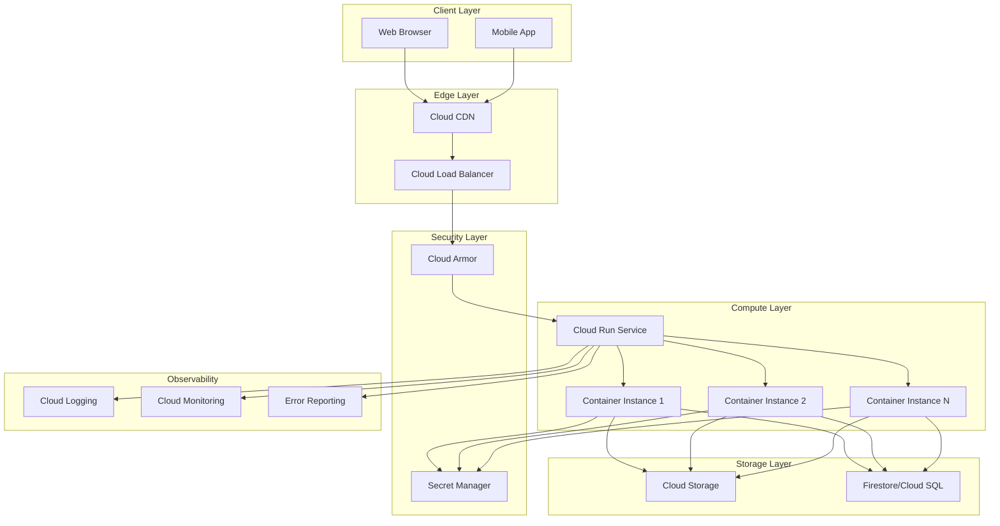

# Architecture Documentation

## System Overview

This portfolio backend is designed as a cloud-native, serverless application optimized for Google Cloud Platform. The architecture emphasizes scalability, security, and cost-efficiency.

## Architecture Diagram



## Component Details

### 1. Cloud Run (Compute)

**Purpose**: Serverless container platform for running the Express.js backend

**Features**:
- Automatic scaling from 0 to N instances
- Pay-per-use pricing (100ms billing granularity)
- Built-in HTTPS and managed SSL certificates
- Zero-downtime deployments with traffic migration
- Regional availability with multi-region support

**Configuration**:
```yaml
CPU: 1 vCPU
Memory: 512 MiB
Min Instances: 0 (scales to zero)
Max Instances: 10
Concurrency: 80 requests per instance
Timeout: 300 seconds
```

**Benefits**:
- No server management
- Automatic HTTPS
- Built-in load balancing
- Container-based deployment
- Fast cold starts (<1s)

### 2. Cloud CDN (Content Delivery)

**Purpose**: Global content delivery network for static assets and API responses

**Features**:
- 100+ edge locations worldwide
- Automatic cache invalidation
- Custom cache keys
- Signed URLs for private content
- Cache mode: CACHE_ALL_STATIC

**Cache Strategy**:
```
Static Assets:    24 hours (86400s)
API Responses:    1 hour (3600s)
Dynamic Content:  No cache
```

**Benefits**:
- Reduced latency (serve from nearest edge)
- Lower bandwidth costs
- Improved performance
- Reduced load on Cloud Run

### 3. Cloud Storage (Object Storage)

**Purpose**: Scalable storage for static assets (images, documents, media)

**Features**:
- Unlimited storage capacity
- Multiple storage classes (Standard, Nearline, Coldline)
- Versioning and lifecycle management
- Public and signed URL access
- CORS configuration for web access

**Use Cases**:
- Portfolio images and screenshots
- Resume/CV PDFs
- Project assets and media
- User-uploaded content

**Configuration**:
```
Location: us-central1 (or multi-region)
Storage Class: Standard
Access: Public read, authenticated write
Lifecycle: 90-day Nearline transition
```

### 4. Secret Manager (Security)

**Purpose**: Secure storage and management of sensitive data

**Stored Secrets**:
- API keys (SendGrid, reCAPTCHA, etc.)
- Database credentials
- OAuth client secrets
- Encryption keys
- Third-party service tokens

**Features**:
- Automatic encryption at rest
- Access control with IAM
- Secret versioning
- Audit logging
- Automatic rotation support

**Access Pattern**:
```typescript
// Secrets mounted as environment variables in Cloud Run
const apiKey = process.env.API_KEY; // from Secret Manager
```

### 5. Optional: Firestore/Cloud SQL (Database)

**Purpose**: Persistent data storage for dynamic content

**Firestore** (NoSQL):
- Use for: Contact form submissions, analytics, user preferences
- Features: Real-time updates, offline support, auto-scaling
- Pricing: Pay-per-operation

**Cloud SQL** (PostgreSQL/MySQL):
- Use for: Complex relational data, transactions
- Features: Fully managed, automatic backups, high availability
- Pricing: Instance-based

**Recommended**: Firestore for this use case
```javascript
// Store contact submissions
await firestore.collection('contacts').add({
  name: formData.name,
  email: formData.email,
  message: formData.message,
  timestamp: new Date(),
  status: 'new'
});
```

### 6. Cloud Logging (Observability)

**Purpose**: Centralized logging for debugging and monitoring

**Features**:
- Structured logging with JSON
- Log levels (debug, info, warn, error)
- Log retention (30 days default)
- Search and filtering
- Integration with Cloud Monitoring

**Log Structure**:
```json
{
  "severity": "INFO",
  "timestamp": "2024-01-01T00:00:00.000Z",
  "message": "Request processed",
  "httpRequest": {
    "requestMethod": "GET",
    "requestUrl": "/api/portfolio",
    "status": 200,
    "latency": "0.123s"
  }
}
```

### 7. Cloud Monitoring (Metrics & Alerts)

**Purpose**: Real-time monitoring and alerting

**Key Metrics**:
- Request count and rate
- Request latency (p50, p95, p99)
- Error rate and 5xx responses
- Container instance count
- CPU and memory utilization
- Network ingress/egress

**Alerting Policies**:
- Error rate > 5% for 5 minutes
- Latency p99 > 2 seconds
- Instance count at max capacity
- Memory usage > 90%

## Data Flow

### Request Flow

```
1. User Request
   ↓
2. DNS Resolution → Cloud CDN
   ↓
3. CDN Cache Check
   ├─ HIT: Return cached response
   └─ MISS: Forward to Load Balancer
       ↓
4. Cloud Load Balancer
   ↓
5. Cloud Armor (DDoS Protection)
   ↓
6. Cloud Run Service
   ├─ Route to available container instance
   ├─ Process request (Express.js)
   ├─ Fetch data from Storage/Database
   ├─ Apply business logic
   └─ Generate response
       ↓
7. Response
   ├─ Set cache headers
   ├─ Log request
   └─ Return to client
```

### Deployment Flow

```
1. Code Push to GitHub
   ↓
2. GitHub Actions Triggered
   ├─ Run tests
   ├─ Run linter
   └─ Build TypeScript
       ↓
3. Build Docker Image
   ↓
4. Push to Artifact Registry
   ↓
5. Deploy to Cloud Run
   ├─ Create new revision
   ├─ Gradually shift traffic
   └─ Monitor health checks
       ↓
6. Deployment Complete
   └─ Send notification
```

## Scaling Strategy

### Horizontal Scaling (Cloud Run)

```
Auto-scaling based on:
- Request rate
- CPU utilization
- Memory usage
- Custom metrics

Scale up: New instances in <5 seconds
Scale down: Gradual termination after idle period
```

### Vertical Scaling

```
Adjust container resources:
- CPU: 1-8 vCPUs
- Memory: 128 MiB - 32 GiB

Recommendation:
- Start: 1 CPU, 512 MiB
- Monitor: CPU and memory utilization
- Adjust: Based on actual usage patterns
```

## Security Architecture

### Defense in Depth

```
Layer 1: Cloud Armor (DDoS protection)
Layer 2: Cloud CDN (Rate limiting)
Layer 3: Cloud Load Balancer (SSL termination)
Layer 4: Cloud Run (Container isolation)
Layer 5: Application (Input validation, auth)
Layer 6: Secret Manager (Credential protection)
```

### Network Security

```
- HTTPS enforced (TLS 1.2+)
- VPC connector (optional for private resources)
- Service-to-service authentication
- IAM-based access control
```

## Cost Optimization

### Estimated Monthly Costs

```
Cloud Run:
- 1M requests/month
- 100ms avg response time
- $0.40 compute + $0.024 requests = ~$0.42

Cloud Storage:
- 10 GB storage
- 1M read operations
- $0.20 storage + $0.40 operations = ~$0.60

Cloud CDN:
- 100 GB egress
- 10M cache lookups
- $8.00 egress + $1.00 lookups = ~$9.00

Total: ~$10/month for moderate traffic
```

### Cost Optimization Tips

1. **Enable CDN caching**: Reduce Cloud Run invocations
2. **Use appropriate cache durations**: Balance freshness vs. cost
3. **Scale to zero**: No cost when idle
4. **Optimize container**: Faster startup = lower costs
5. **Use storage lifecycle**: Move old data to cheaper tiers

## Disaster Recovery

### Backup Strategy

```
Cloud Storage:
- Versioning enabled
- Geo-redundant storage
- 30-day soft delete

Firestore/Cloud SQL:
- Automated daily backups
- Point-in-time recovery
- Cross-region replication (optional)

Configuration:
- Infrastructure as Code (Terraform)
- Version controlled (Git)
```

### Recovery Time Objective (RTO)

```
Cloud Run service failure: < 5 minutes
- Automatic health checks
- Automatic restarts
- Traffic migration to healthy instances

Region failure: < 30 minutes
- Manual intervention required
- Deploy to different region
- Update DNS/CDN configuration
```

## Performance Optimization

### Response Time Targets

```
Cold start: < 1 second
Warm request: < 100ms (API)
Static assets: < 50ms (CDN)
Database query: < 50ms
```

### Optimization Techniques

1. **Container optimization**:
   - Multi-stage Docker builds
   - Minimal base image (Alpine)
   - Layer caching

2. **Code optimization**:
   - Async/await patterns
   - Connection pooling
   - Query optimization

3. **Caching strategy**:
   - CDN for static content
   - Application-level caching
   - Database query caching

## Future Enhancements

1. **Multi-region deployment**:
   - Deploy to multiple regions
   - Global load balancing
   - Reduced latency worldwide

2. **Advanced monitoring**:
   - Custom dashboards
   - SLO tracking
   - Anomaly detection

3. **Enhanced security**:
   - Web Application Firewall (WAF)
   - Identity-Aware Proxy (IAP)
   - Data Loss Prevention (DLP)

4. **Performance**:
   - HTTP/3 support
   - Service mesh (Istio)
   - GraphQL API

---

This architecture provides a solid foundation for a production portfolio website with room for growth and enhancement as requirements evolve.
